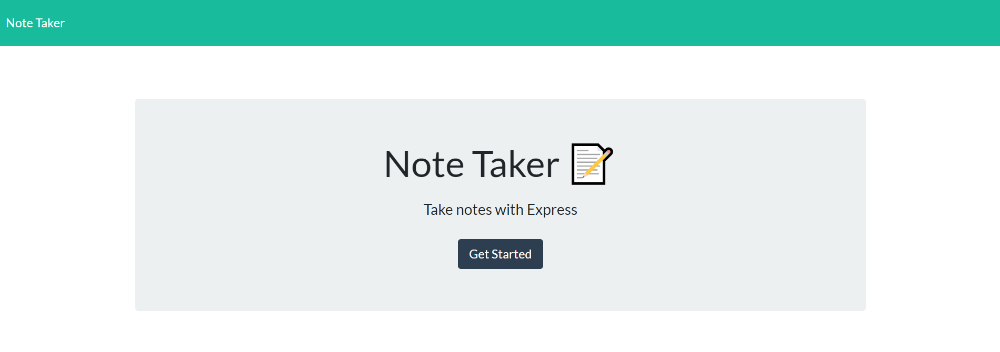
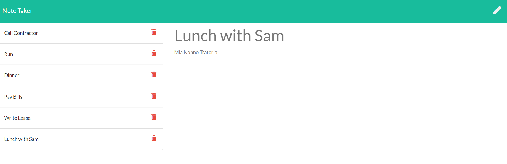

# Note Taker
## 
## Description 
This application allows users to record and delete a set of notes. 

Notes are stored on a server, making the application readily accessible with an internet connection.
## Table of Contents
- [Installation](#installation)
- [Deployed Application](#application)
- [Usage](#usage)
- [Screenshot](#screenshot)
- [Tests](#tests)
- [Questions](#questions)
## Installation
Run the application from the deployed Heroku link.

## Application
[Application](https://evening-ravine-70496.herokuapp.com/)

## Usage
```
To use the appliation, launch it from its deployed link. Click Get Started to begin.

Add new notes and descriptions. Save them by clicking on the disk icon. 

Delete notes by clicking on the trash icon. Click on the pencil to add new notes.
```
## Screenshot



## Tests
```
To test this application, open its link and enter information. Add and delete notes.
```
## Questions

If you have questions about the repo, open an issue or contact me at 
cstuhlfire@gmail.com. 

You can find this project along with my other work 
at: [github](https://github.com/cstuhlfire).


